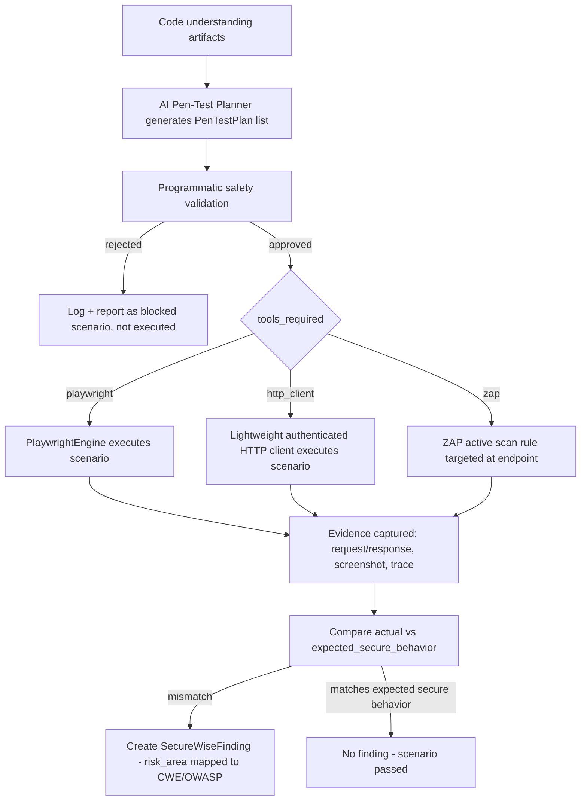

# AI Pen-Test Planner — Design

## Purpose

Use the LLM to read code (routes, controllers, serializers, permissions, models, OpenAPI specs, auth code,
forms, frontend API clients, database schema — all already partially collected by `CodeUnderstandingEngine`)
and generate a structured, **safe-only** set of test scenarios that the runtime testing stage can execute
against the app SecureWise itself started in its own sandbox (see `RUNTIME_TEST_ENVIRONMENT.md`).

New module: `apps/securewise/services/ai_pentest_planner.py`. Reuses the existing AI provider abstraction
(`get_ai_provider()` from `services/ai_recommendation.py`) — no new AI plumbing required, only a new
prompt/schema and a validation layer.

## Inputs the planner reads

- Route/URL tables (framework-specific extraction, e.g. Django `urls.py` + DRF viewset actions, Express
  route definitions, Spring `@RequestMapping`).
- Serializers/DTOs (field-level permission hints, e.g. DRF `read_only_fields`).
- Permission classes / middleware (auth requirements per route).
- Models (foreign keys — used to reason about IDOR risk, e.g. "endpoint takes `id` but no ownership filter
  visible in the queryset").
- OpenAPI/Swagger specs discovered by `CodeUnderstandingEngine`.
- Auth flow type (`session` | `jwt` | `oauth`) from `ApplicationRunPlan.auth_flows`.
- Frontend API client calls (to catch endpoints that exist but aren't in any spec — "shadow" endpoints).

## Output schema: `PenTestPlan`

```json
{
  "scenario_id": "uuid",
  "title": "string",
  "risk_area": "missing_authentication | missing_authorization | idor | role_bypass | weak_session | csrf | file_upload | ssrf | open_redirect | mass_assignment | rate_limiting | sensitive_data_exposure | security_headers | business_logic_abuse",
  "target_endpoint": "string (path + method)",
  "preconditions": ["string", "..."],
  "test_steps": ["string", "..."],
  "expected_secure_behavior": "string",
  "unsafe_behavior": "string",
  "evidence_to_collect": ["request/response pair", "screenshot", "..."],
  "tools_required": ["playwright" | "http_client" | "zap"],
  "safe_to_run_in_prod": false,
  "requires_active_testing": true,
  "destructive": false,
  "authorization_required": true
}
```

Django model to persist plans (new): `SecureWisePenTestPlan` — FK to `SecureWiseScan`, all fields above as
columns (JSON for list fields), plus `status` (`planned | executed | skipped | rejected`) and
`execution_result` (FK to the finding it produced, if any).

## Hard safety rules (enforced in code, not just prompt instructions)

The LLM prompt instructs the model to never propose destructive/credential-attack scenarios, but **this must
also be enforced programmatically** after generation, since LLM output cannot be fully trusted:

```python
def validate_pentest_plan(plan: dict) -> bool:
    if plan.get("destructive") is True:
        return False  # hard reject, never executed, MVP has zero tolerance for destructive tests
    if plan.get("risk_area") not in ALLOWED_RISK_AREAS:
        return False
    if _looks_like_credential_attack(plan):  # keyword check: "brute force", "dictionary attack", "password spray"
        return False
    if _targets_external_domain(plan, allowed_base_url):  # must match the sandboxed runtime base_url only
        return False
    return True
```

- **No destructive tests in MVP** — any plan with `destructive: true` is rejected before execution, logged,
  and surfaced as "AI proposed a destructive scenario that was automatically blocked" (transparency, not
  silent dropping).
- **No credential attacks** — no brute force, no dictionary attacks, no password spraying. Login flow tests
  use a single pre-provisioned safe test account (created by `RuntimeEnvironmentManager` as a seed step if
  the app supports one, or skipped if not).
- **No real data deletion** — scenarios that would `DELETE` or destructively mutate records are rejected
  unless they target a resource created by the test itself (self-cleanup only).
- **No scanning of third-party domains** — `target_endpoint` must resolve to the sandboxed
  `RuntimeEnvironment.base_url` only; any plan referencing an external domain is rejected outright.
- **Only approved targets** — the executor cross-checks `SecureWiseScan.target_authorization_confirmed`
  before running anything beyond the self-started sandbox.

## Execution flow



## Mapping risk_area → CWE/OWASP (reuses existing `scanners/cwe_mapping.py`)

| risk_area | CWE (example) | OWASP Top 10 |
|---|---|---|
| missing_authentication | CWE-306 | A07:2021 |
| missing_authorization / role_bypass | CWE-862/863 | A01:2021 |
| idor | CWE-639 | A01:2021 |
| weak_session | CWE-613 | A07:2021 |
| csrf | CWE-352 | A01:2021 |
| file_upload | CWE-434 | A04:2021 |
| ssrf | CWE-918 | A10:2021 |
| open_redirect | CWE-601 | A01:2021 |
| mass_assignment | CWE-915 | A08:2021 |
| rate_limiting | CWE-799 | A04:2021 |
| sensitive_data_exposure | CWE-200 | A02:2021 |
| security_headers | CWE-693 | A05:2021 |
| business_logic_abuse | CWE-840 | A04:2021 |

This table extends the existing `scanners/cwe_mapping.py` module rather than duplicating mapping logic
elsewhere.

## Why this is safe to build now (given current architecture gaps)

This planner can be designed and even partially built (prompt + schema + validation function) **before**
`RuntimeEnvironmentManager` exists, since plan *generation* has no runtime dependency. Execution must wait for
the runtime layer, so the natural sequencing is: build the planner + validator first (cheap, low-risk),
defer the *executor* integration until `RUNTIME_TEST_ENVIRONMENT.md` and `PLAYWRIGHT_ENGINE_DESIGN.md` are
implemented (see `IMPLEMENTATION_ROADMAP.md` Phase 6).
