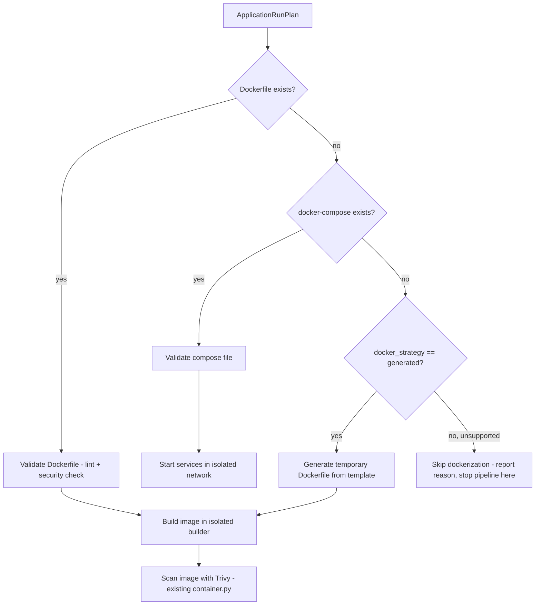

# DockerizationEngine — Design

## Purpose

Turn an `ApplicationRunPlan` (from `CodeUnderstandingEngine`) into a runnable, isolated container image,
without ever assuming the target repo already has correct Docker tooling. New module:
`apps/securewise/services/dockerization.py`.

## Decision flow

## Validating an existing Dockerfile

Before building, run static checks (reuse existing IaC scanner logic in `scanners/iac.py`, which already has
Dockerfile-aware rules) plus Dockerization-specific checks:

- Rejects `FROM <image>:latest` with a **warning** (not a hard stop) — recommend pinning.
- Flags `USER root` / missing `USER` directive as a finding (already partially covered by `iac.py`).
- Flags exposed secrets baked into `ENV`/`ARG` (cross-check with `scanners/secrets.py`).
- Confirms an `EXPOSE` directive exists; if not, port must come from `ApplicationRunPlan.exposed_ports`.

## Generating a temporary Dockerfile (when none exists)

Template library keyed by detected framework, stored as versioned template strings (not committed into the
user's repo — always written to the ephemeral scan workspace only, and deleted at scan end unless the user
explicitly opts in to "save generated Dockerfile as a PR suggestion", which is an explicit opt-in action, not
a default).

| Framework | Template strategy |
|---|---|
| Python Django/FastAPI | `python:3.12-slim` base, `pip install -r requirements.txt` (or `poetry install`), `CMD` from `ApplicationRunPlan.start_command`, non-root user |
| Node/React/Next/Express | Multi-stage: `node:20-slim` build stage (`npm ci && npm run build`) → runtime stage serving build output or `node server.js` |
| Java Spring Boot | `eclipse-temurin:21-jre` runtime + `maven:3.9-eclipse-temurin-21` build stage producing the jar |
| Go | Multi-stage: `golang:1.22` build → `gcr.io/distroless/static` or `alpine` runtime with the compiled binary |
| PHP Laravel | `php:8.3-fpm` + composer install + `php artisan serve` (dev-mode only, clearly labeled as scan-only, not representative of prod nginx/php-fpm setup) |
| Ruby Rails | `ruby:3.3-slim` + `bundle install` + `rails server` |

All generated templates:
- Run as a non-root user.
- Do not `ADD`/`COPY` anything outside the cloned repo workspace.
- Set a conservative default `HEALTHCHECK` hitting `ApplicationRunPlan.health_check_url`.
- Never bake real secrets — required env vars are injected at container-start time by
  `RuntimeEnvironmentManager` using generated dummy/test values (see that doc for details), never the user's
  production secrets.

## Build safety controls

- Builds run inside a dedicated, resource-limited builder (e.g., `docker build` invoked with
  `--memory`, `--cpu-quota`, and an overall wall-clock timeout enforced by the orchestrator, matching the
  pattern already used for the optional build in `scanners/container.py:79-106`, generalized).
- Build context is the ephemeral scan workspace tempdir only — never the host filesystem beyond that.
- No `--privileged`, no bind-mounting the Docker socket into the target container (only the orchestrator
  process itself talks to the Docker daemon).
- Build logs are captured and stored (truncated) for troubleshooting/evidence, associated with the scan.

## After build: mandatory image scan

Every image — whether validated-existing, compose-started, or generated — is scanned with the **existing**
`scanners/container.py` Trivy-image logic before the container is ever started for runtime testing. A
critical/high vulnerability in the base image does not block runtime testing by default (informational), but
is always included in the final report.

## Cleanup guarantee

- Images and containers built/started for a scan are tagged with the `scan_id` (e.g.,
  `securewise-scan-<uuid>`) and are **always** removed at the end of the scan — success, failure, or
  timeout — via a `finally`-guaranteed teardown routine (mirrors the existing `docker rmi` cleanup pattern
  in `scanners/container.py:79-106`, generalized into a `DockerizationEngine.cleanup(scan_id)` method callable
  independently as a safety-net cron job that garbage-collects anything tagged with a scan_id whose scan is
  no longer running).

## What this explicitly does NOT do (MVP guardrails)

- Does not push generated images to any registry.
- Does not modify the user's repository (no commits, no PRs) unless the user explicitly requests "suggest
  this Dockerfile as a PR" as a separate, opt-in action.
- Does not attempt multi-service orchestration beyond what's declared in an existing `docker-compose.yml`
  (i.e., it will not invent a database service the user didn't declare — if the app needs Postgres and no
  compose service provides it, this is surfaced as a `risk_note`/blocker from `CodeUnderstandingEngine`, and
  a minimal ephemeral Postgres container may be added automatically **only** if `ApplicationRunPlan` detected
  a standard DB dependency with no override, using safe throwaway credentials).
