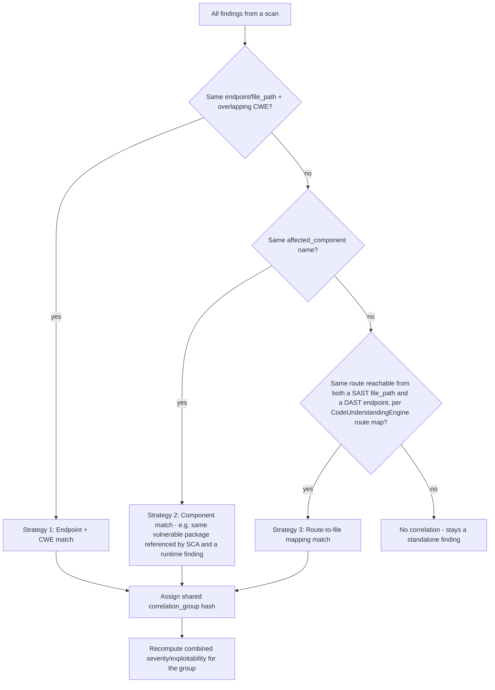

# Finding Correlation Engine — Design

## Current state

A limited form of correlation already exists: `scanners/orchestrator.py:52-158` performs fingerprint-based
deduplication and a DAST↔SAST correlation pass within a single scan run. This is **real but narrow** — it
doesn't generalize across all scanner types, doesn't persist a queryable correlation grouping, and doesn't
correlate SCA (vulnerable dependency) findings with confirmed runtime exploitability.

## Goal

Generalize this into a standalone `FindingCorrelationEngine` (`apps/securewise/services/correlation_engine.py`)
that runs as the post-processing stage of `FullScanOrchestrator` (see `FULL_SCAN_ORCHESTRATOR.md` stage S7c),
producing a `correlation_group` value (new field, `UNIFIED_FINDING_MODEL.md`) shared by findings that
represent the same underlying vulnerability, so the UI/report can present **one correlated incident** instead
of N noisy, disconnected findings.

## Example (the exact scenario from the requirements)

- SAST (semgrep) finds a SQL injection pattern in `views.py:142` — `exploitability=theoretical`.
- ZAP DAST confirms the same endpoint is actually injectable at runtime — `exploitability=confirmed`.
- SCA (trivy) separately flags a vulnerable DB driver version used by that same code path.

Without correlation: 3 separate findings, 3 separate severities shown, no indication they're related.
With correlation: all 3 share `correlation_group = "corr-<hash>"`, the UI shows one primary "critical
incident" card (SQL Injection — Confirmed Exploitable) with the SCA and SAST findings nested underneath as
supporting evidence, and the *combined* severity/exploitability is elevated to reflect the confirmed runtime
proof (a theoretical SAST finding + a confirmed DAST hit is worse than either alone).

## Correlation strategies (in priority order)



1. **Endpoint + CWE match** (already partially implemented in `orchestrator.py`) — same `endpoint` (or
   `file_path` mapped to the same route via `CodeUnderstandingEngine`'s route table) and overlapping/related
   `cwe_id` values (e.g., CWE-89 SQLi from SAST + CWE-89 from a ZAP alert).
2. **Component match** — same `affected_component` (package name) referenced by an SCA finding and any
   runtime finding whose evidence implicates that component (e.g., an error message/stack trace captured by
   Playwright/ZAP evidence mentioning the vulnerable library).
3. **Route-to-file mapping match** — uses the route table already produced by `CodeUnderstandingEngine`
   (`auth_flows`/route detection) to map a DAST/API finding's `endpoint` back to the `file_path`/controller
   that serves it, allowing correlation even when CWE codes differ slightly between tools' taxonomies.

## Severity/exploitability recomputation

When a group is formed, the engine recalculates a **group-level severity** using a simple, explainable rule
(not another opaque AI call) so this behavior stays auditable:

```python
def recompute_group_severity(findings_in_group):
    has_confirmed_runtime = any(f.exploitability == "confirmed" for f in findings_in_group)
    max_static_severity = max(f.severity for f in findings_in_group, key=SEVERITY_ORDER.index)
    if has_confirmed_runtime and max_static_severity in ("medium", "high"):
        return escalate_one_level(max_static_severity)  # e.g. medium -> high, high -> critical
    return max_static_severity
```

This escalation logic is intentionally simple and deterministic — correlation grouping is a place where
false confidence is dangerous, so the engine favors transparent, debuggable rules over a black-box AI
judgment call. AI is used downstream (in `AIRecommendationEngine`) to *explain* the correlated incident in
plain English, not to decide the grouping/severity itself.

## Data model

No new model needed — `correlation_group` (added to `SecureWiseFinding` per `UNIFIED_FINDING_MODEL.md`) is
sufficient; a "correlation summary" view can be computed on read (group by `correlation_group`, non-null) 
rather than maintaining a separate incident table, keeping this additive and low-risk.

## Where it plugs into the existing orchestrator

`scanners/orchestrator.py`'s existing DAST↔SAST correlation logic becomes **Strategy 1** inside the new,
more general `FindingCorrelationEngine`, called once at the end of `FullScanOrchestrator` (not per-scanner),
so it can see findings from *all* engines (static + runtime) at once — today it can only correlate within
the single orchestrator run's own static-scanner outputs.
