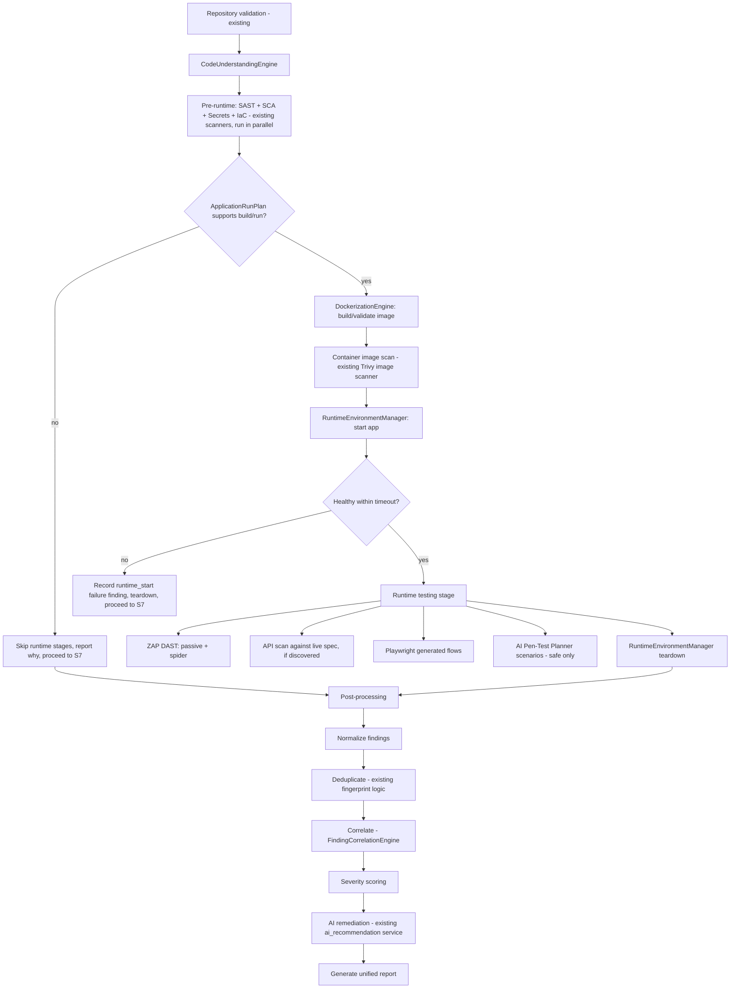

# FullScanOrchestrator — Design

## Purpose

Extend the existing `services/scanner.py::ScannerRunner` (which today only runs static scanners) into a
full-pipeline orchestrator when `scan_type == "full"`. This is additive — `ScannerRunner` remains the entry
point for individual scan types (`sast`, `sca`, `secrets`, `iac`, `container`, `api`, `dast`), and
`FullScanOrchestrator` composes them plus the new runtime/dynamic stages.

New module: `apps/securewise/services/full_scan_orchestrator.py`.

## Stage sequence

## Execution model

- Each stage records a `SecureWiseScanEngineResult` row (existing model), so the existing frontend polling
  UI (`ScanDetailPage.tsx`) works unchanged for the new stages — they just appear as additional engine rows
  (`code_understanding`, `dockerize`, `container_scan`, `runtime_start`, `zap_dast`, `api_live_scan`,
  `playwright`, `ai_pentest`).
- Stages S2 (static scanners) can run in parallel (they already are largely independent); S4-S8 (build →
  runtime → dynamic testing) are strictly sequential because each depends on the previous succeeding.
- The whole `full` pipeline runs as a **single background job** (see async requirements below) rather than
  one thread per engine, so total wall-clock time and resource usage can be capped centrally.

## Honesty rules baked into the orchestrator (addresses Current Review risk #1 and #2)

1. Every `SecureWiseScanEngineResult` must have a `mode` field (new, small addition) — one of
   `real_tool | fallback_heuristic | passive_only | skipped | not_configured` — surfaced directly in the UI
   next to the engine name so a user never mistakes a fallback/passive run for a full real scan.
2. `SecureWiseScan.status` can only become `completed` if at least one engine actually ran in
   `real_tool` mode for scan types that claim to be "full" — if every engine ran in `fallback_heuristic`
   or `skipped` mode, the scan status becomes `completed_partial` (new status value) with a clear banner:
   "This scan completed but ran mostly in fallback/passive mode — install required tools or provide runtime
   config for full coverage." This directly fixes the "fake completed successfully" issue flagged in
   `IMPLEMENTATION_ROADMAP.md` Phase 1 and the user's Step 17 instruction.
3. If `CodeUnderstandingEngine` cannot confidently produce a run plan, stages S3-S8 are skipped with an
   explicit `skip_reason` recorded on the engine result — never silently absent from the report.

## Async execution requirement

Given a full pipeline can take several minutes (build + container start + dynamic scans), this is the point
at which the existing thread-based execution (`views.py:645,707`, explicitly marked MVP-only) must be
replaced with a real task queue:

- **Recommended**: Celery + Redis (Redis is lightweight to add to the existing docker-compose/deployment,
  and Celery is the most mature option for Django).
- Orchestrator stages become a Celery **chain/chord**: static scanners run as a parallel group, followed by
  the sequential build→runtime→dynamic chain, followed by a post-processing task.
- Each Celery task updates `SecureWiseScan.progress` and the relevant `SecureWiseScanEngineResult` exactly
  like the current synchronous code does — no change needed to the polling API contract the frontend
  already uses (`/scans/{id}/progress/`).
- Worker crash recovery: Celery's `acks_late` + task retry with a dead-letter queue replaces the current "if
  the thread dies, the scan is stuck forever" failure mode.

## Data model additions

- `SecureWiseScanEngineResult.mode` (new `CharField`, choices above).
- `SecureWiseScan.status` gains `completed_partial` alongside existing choices.
- `SecureWiseScan` gains `target_authorization_confirmed` (bool) + `target_authorization_note` (text) for the
  authorization gate described in `TARGET_ARCHITECTURE.md` — required `True` before stage S6 (runtime start)
  or any dynamic testing runs against anything other than the app SecureWise itself started in its own
  sandbox.

## Where this doesn't change existing behavior

- Individual scan types (`sast`, `sca`, `secrets`, `iac`, `container`, `api`, `dast`) run exactly as they do
  today via `ScannerRunner` — no regression for users who only want a quick static scan.
- `FullScanOrchestrator` is purely additive, invoked only when `scan_type == "full"` **and** the new runtime
  stages are enabled (feature-flagged via `SecureWiseScanPolicy` so existing orgs aren't surprised by a
  sudden Docker build step appearing in their "full scan").
