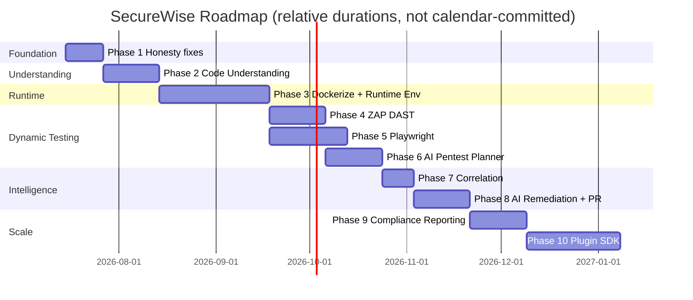

# Implementation Roadmap — SecureWise Evolution

This roadmap sequences the work described across `TARGET_ARCHITECTURE.md` and the individual engine design
docs. Phases are ordered by **dependency and risk**, not by arbitrary priority — each phase either unblocks
the next or fixes a foundational honesty/reliability issue before more features are stacked on top.

## Phase 1 — Make the current scan engine real and honest (no new capability, fix what exists)

**Why first:** every later phase inherits the current architecture's honesty problems (silent fallback mode,
thread-based execution, stale comments). Fixing these first is cheap and de-risks everything else.

- Mark mock vs real engines explicitly: add `mode` field to `SecureWiseScanEngineResult` and
  `SecureWiseFinding` (`real_tool | fallback_heuristic | passive_only | ai_generated | skipped`), surfaced in
  UI next to each engine/finding.
- Ensure `semgrep`/`trivy`/`gitleaks` binaries are actually present in the deployed container (currently
  `requirements.txt` only has `semgrep`; `Dockerfile` does not install `trivy`/`gitleaks` per audit) — fix
  the Dockerfile so "real tool" mode is the default in production, not silently degraded.
- Introduce `completed_partial` scan status: a scan cannot report `completed` if every engine ran in
  fallback/skipped mode.
- Fix stale docstring on `SecureWiseFinding.ai_fix_suggestion` ("TODO: integrate LLM" — already integrated).
- Add clear `skip_reason` text everywhere a scanner is skipped (e.g., container scan skipped because no
  `docker_image` was supplied).
- No new engines, no runtime execution yet — purely a trust/correctness pass on what exists today.

**Effort:** Small (~1-2 weeks). **Risk:** Low.

## Phase 2 — Repository Understanding Engine

- Build `CodeUnderstandingEngine` + `ApplicationRunPlan` model (see `CODE_UNDERSTANDING_ENGINE.md`).
- Deterministic detection first; AI-assisted fallback second.
- Surface the "scan plan preview" in the frontend (new UX gap identified in `UX_GAP_ANALYSIS.md`).
- No dockerization/runtime execution yet — this phase only *detects and plans*, doesn't *act*.

**Effort:** Medium (~2-3 weeks). **Risk:** Low-medium (mostly new code, no destructive capability yet).

## Phase 3 — Dockerization and runtime environment

- Build `DockerizationEngine` (validate/build/generate images) and `RuntimeEnvironmentManager` (isolated
  start/stop/health-check/log capture) — see `DOCKERIZATION_ENGINE.md`, `RUNTIME_TEST_ENVIRONMENT.md`.
- This is the **highest-risk phase** technically (container orchestration, network isolation, resource
  limits, cleanup guarantees) — needs careful testing of the teardown-on-failure paths especially.
- Replace thread-based scan execution with a real task queue (Celery + Redis) — this phase's jobs are the
  first ones long/complex enough to make this replacement non-optional (see `FULL_SCAN_ORCHESTRATOR.md`
  "Async execution requirement").
- Deliverable: SecureWise can build and start a target application in an isolated sandbox and confirm it's
  healthy — no dynamic testing runs against it yet.

**Effort:** Large (~4-6 weeks). **Risk:** High (new infra dependency: Docker-in-Docker or sibling-container
access from the worker; must be validated in the actual deployment environment, e.g. Render, before
committing to this design).

## Phase 4 — Advanced ZAP DAST integration

- Extend the current ZAP baseline implementation with the fuller `ZAP_DAST_ENGINE.md` design.
- Passive baseline scan is available today; spidering/authenticated context support should be added once a target is healthy (from Phase 3); active scan opt-in only.
- This keeps "DAST" honest while adding deeper coverage in controlled policy modes.

**Effort:** Medium (~2-3 weeks). **Risk:** Medium (ZAP container orchestration, auth flow configuration).

## Phase 5 — Playwright authenticated flows

- Build `PlaywrightEngine` (`PLAYWRIGHT_ENGINE_DESIGN.md`) — login flow testing, authenticated crawling,
  evidence capture.
- Structured step interpreter first (safe); AI-generated full scripts as a later, more sandboxed fallback.

**Effort:** Medium-large (~3-4 weeks). **Risk:** Medium (browser automation in constrained containers can be
flaky; needs generous timeouts and good error surfacing).

## Phase 6 — AI pen-test planner

- Build `AI_PENTEST_PLANNER.md`'s scenario generation + **programmatic** safety validation (never trust LLM
  output alone for destructive/credential-attack filtering).
- Wire planner output into the Playwright/ZAP/HTTP-client executors built in Phases 4-5.
- This phase can start in parallel with Phase 5 for the *planning* half (prompt + schema + validator), since
  it has no runtime dependency — only *execution* waits on Phase 5.

**Effort:** Medium (~2-3 weeks, can overlap with Phase 5). **Risk:** Medium — primarily a safety/validation
risk, not a technical complexity risk; requires careful review of the reject-rules before enabling for any
real customer.

## Phase 7 — Finding correlation

- Generalize the existing DAST↔SAST fingerprint correlation in `orchestrator.py` into the standalone
  `FindingCorrelationEngine` (`FINDING_CORRELATION_ENGINE.md`), now with real runtime findings (Phases 4-6)
  to correlate against.

**Effort:** Small-medium (~1-2 weeks). **Risk:** Low (deterministic, auditable logic, no new infra).

## Phase 8 — AI remediation and PR generation

- Extend `services/ai_recommendation.py` per `AI_RECOMMENDATION_ENGINE.md`: richer structured response,
  correlated-incident explanations, advisory PR patch suggestions.
- Consolidate the two existing remediation systems (scanner templates + AI) into the tiered baseline+
  enrichment model described in that doc.

**Effort:** Medium (~2-3 weeks). **Risk:** Low-medium (mostly prompt engineering + response validation; PR
patch generation needs careful "never auto-apply" guardrails).

## Phase 9 — Compliance and executive reporting

- Extend the already-real report pipeline (`services/report.py`, `services/report_render.py`) with runtime
  evidence sections (screenshots, ZAP alerts, Playwright traces), correlated-incident summaries, and
  compliance-framework mappings (e.g., SOC2/ISO27001 control cross-references) for executive audiences.

**Effort:** Medium (~2-3 weeks). **Risk:** Low (builds on proven, working report infrastructure).

## Phase 10 — Enterprise plugin SDK

- Define a stable interface for third-party/custom scanners to plug into the orchestrator (implement the
  same `mode`/finding-shape contract as built-in scanners), enabling customers to bring their own tools
  (e.g., a proprietary internal SAST rule engine) into the unified pipeline and report.

**Effort:** Large (~4+ weeks, plus ongoing SDK maintenance/versioning). **Risk:** Medium (API stability
commitments needed once external parties depend on it — should only be started once Phases 1-9 have
stabilized the core finding/engine contracts).

## Sequencing summary

Phases 4 and 5 can run partially in parallel once Phase 3 is stable (both only need a healthy running target,
not each other). Phase 6's planning half can start alongside Phase 5. Everything else is a hard sequential
dependency chain.
