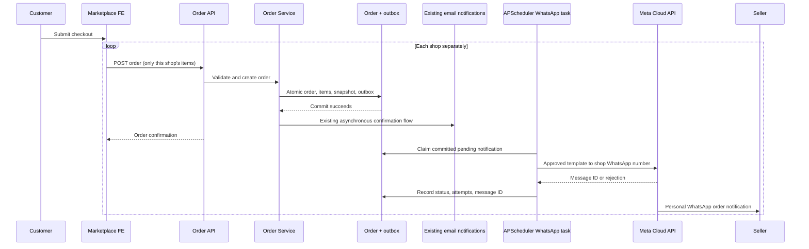

# Marketplace seller WhatsApp order alerts

## Architecture and scope

The seller receives a **personal, one-to-one WhatsApp message** at the existing
`ShopSettings.whatsapp_number` shown in shop contact details. The destination is
not `whatsapp_group_url` or `whatsapp_url`. No second phone-number setting is
introduced. The sender is the platform's registered WhatsApp Business number;
the seller's receiving number can be a normal personal WhatsApp account.

The Marketplace frontend groups its cart by shop and submits one order per shop.
The backend validates availability, quantities, fulfillment, and prices before
creating the order and item/fulfillment snapshots. A successfully committed
`pending` or automatically `accepted` order is the trigger, **not a payment
confirmation**. Current cash/bank-transfer checkout does not wait for payment.

`WhatsAppNotificationService.enqueue` creates a unique order outbox record
inside the same transaction. Rollbacks therefore cannot produce an alert.
APScheduler reads committed records every five seconds and calls the service's
`deliver` method. Both the existing development background scheduler and
`python manage.py runapscheduler` register this job. Production should run the
existing dedicated scheduler service. Checkout never calls Meta or waits for
WhatsApp; the existing buyer/seller email flow is unchanged.

The existing FutureWise Twilio provider is reminder-specific and supports a
free-form fallback. Marketplace instead uses a small `WhatsAppProvider`
interface with `MetaCloudWhatsAppProvider`: official API, approved templates
only, no vendor SDK dependency or accidental sandbox/free-form sends.



## Environment configuration

Set these **backend-only** environment variables in the web and scheduler
deployment environment. Django setting overrides are also supported. Existing
environment loading is reused; no secret is included in API responses.

```dotenv
# Values below are placeholders, not credentials.
WHATSAPP_ACCESS_TOKEN=
WHATSAPP_PHONE_NUMBER_ID=
# Select a currently supported Graph API version for your Meta app.
WHATSAPP_API_VERSION=v25.0
WHATSAPP_ORDER_TEMPLATE_NAME=marketplace_new_order
WHATSAPP_ORDER_TEMPLATE_LANGUAGE=en_US
# HTTPS origin of gw-marketplace-fe, never gw-frontend.
MARKETPLACE_SELLER_PORTAL_URL=https://your-marketplace.example.com
```

All six values are required for sending. No access token, sender number ID,
template name, language, or marketplace domain is hardcoded. Missing/invalid
configuration marks the notification failed without affecting the order.
The destination always comes from the shop, never from deployment variables.
The portal link is `/seller/orders?order=<internal order ID>` and still requires
seller authentication and backend ownership checks.

## Meta setup and current template requirements

Official documentation reviewed on 5 October 2026:

- [Service messages and the 24-hour customer service window](https://developers.facebook.com/documentation/business-messaging/whatsapp/messages/send-messages)
- [Template fundamentals, approval, positional parameters and languages](https://developers.facebook.com/documentation/business-messaging/whatsapp/templates/overview)
- [Cloud API Messages endpoint](https://developers.facebook.com/documentation/business-messaging/whatsapp/reference/whatsapp-business-phone-number/message-api)
- [Error codes and explicit transient/throttling rejections](https://developers.facebook.com/documentation/business-messaging/whatsapp/support/error-codes)

Outside the 24-hour customer service window, only pre-approved templates can be
sent. An automatic checkout alert cannot assume the seller has opened that
window. This integration therefore **always sends a template** and never falls
back to arbitrary text. Recipients must opt in.

1. Create/configure a Meta business portfolio, WhatsApp Business Account and
   Meta app with WhatsApp Cloud API. Register the **platform sender** number,
   finish required verification and configure billing/messaging capacity.
2. Give the server a suitably scoped system-user token with
   `whatsapp_business_messaging` permission and access to the sender account.
   Store it in the deployment secret manager; rotate it appropriately.
3. Create the template below in WhatsApp Manager, using **positional** body
   parameters and the exact name/language from environment configuration.
   Supply realistic non-sensitive sample values for all 13 variables.
   Request the utility category for operational order alerts; Meta determines
   final categorization and approval. **Do not deploy assuming approval.**
4. Wait for the template to be **APPROVED** and use a supported Graph version.
   The template body must match the parameter order below. Headers/buttons
   requiring additional parameters are not part of this integration.
5. Obtain the seller's informed opt-in for receiving order alerts. The seller
   portal explains that enabling the toggle is consent for the shop WhatsApp
   number. Only enable a number the seller owns or is authorized to configure.
6. For Meta's test sender, add/verify permitted test recipients in the Meta
   dashboard. A production rollout requires a production sender and approved
   order template, not a Twilio sandbox or the sample `hello_world` template.

Exact template body:

```text
New order - {{1}}
An order has been placed in your shop.
Order: {{2}}
Customer: {{3}}
Phone: {{4}}
Email: {{5}}
Items: {{6}}
Total: {{7}}
Delivery method: {{8}}
Address: {{9}}
Requested date: {{10}}
Requested time: {{11}}
Customer note: {{12}}
Open order: {{13}}
Please review this order in the seller portal before preparing it.
```

| Parameter | Data |
|---|---|
| 1 | Shop name at order time |
| 2 | Public order reference |
| 3-5 | Ordering customer's name, contact phone and email |
| 6 | Only this order's item names and quantities, including selling units |
| 7 | Order total and snapshot currency code |
| 8 | Selected pickup/delivery method |
| 9 | Snapshot pickup address, or this order's customer delivery address |
| 10-11 | Snapshot pickup date and time; not applicable for delivery |
| 12 | Customer's order note |
| 13 | Authenticated Marketplace seller order URL |

Blank details are explicitly represented as `Not provided`. Newlines/tabs in
variable values are normalized to spaces. Long names, items, address and notes
are shortened with `...`, and the rendered body is bounded to 1,024 characters.
The order URL is never truncated. **The portal order remains the authoritative
source of full fulfillment details**, especially when the alert is abbreviated.
No customer credentials, account metadata, other shop's items/addresses, bank
details, access tokens or group invite links are included.

## Seller configuration and API

In `gw-marketplace-fe`, go to **Shop Configuration > Notifications**. Enter or
update the existing shop WhatsApp number and enable new-order WhatsApp alerts.
This same number is used in the shop's existing contact configuration. Email
alerts remain independent. WhatsApp is **disabled by default** for every shop.

`GET/PATCH /api/seller/settings/` adds `whatsapp_notifications_enabled` and reuses
`whatsapp_number`. Changes remain scoped to the authenticated active seller's
shop; passing another shop ID does not change the destination shop. Django
administrators can also manage the shop settings.

```json
{
  "whatsapp_number": "+14155552671",
  "whatsapp_notifications_enabled": true
}
```

International syntax is required: `+`, nonzero country-code first digit and
8-15 digits. Formatting spaces, parentheses and hyphens are accepted and
normalized to canonical E.164. Enabling without a valid number returns HTTP
400. A disabled shop may clear the number. Public shop APIs keep exposing the
existing contact number, but not the new notification toggle or provider config.
WhatsApp registration/reachability is ultimately checked by Meta.

## Local development and safe testing

Apply migration `0014_shopsettings_whatsapp_notifications_enabled_and_more`.
Run the backend and Marketplace frontend normally. The existing development
APScheduler dispatches automatically; production uses `runapscheduler`.
Keep notifications disabled and access tokens unset unless deliberately using
Meta's verified test recipients.

```bash
python manage.py migrate
python -m pytest tests/marketplace/test_whatsapp.py -q
python -m pytest tests/marketplace -q
# In gw-marketplace-fe:
npm test
npm run lint
npm run typecheck
```

Tests inject a fake provider or patch `requests.post`; **they never send live
WhatsApp messages**. Scheduler auto-start is disabled under pytest and Django's
test command, so tests cannot dispatch against the configured application DB.
They cover creation/rollback, disabled/missing number,
failure isolation, data snapshots, pickup/delivery, per-shop isolation,
bounded retries, duplicate claims, interrupted workers, provider payloads,
phone validation, ownership and public serialization.

## Failure handling, audit and operational limitations

`OrderWhatsAppNotification` is a durable, unique-per-order outbox/audit record.
The channel is inherently WhatsApp; the shop is derived from the order instead
of duplicated. It stores recipient, status, provider message ID, attempts,
creation/claim/send timestamps, next attempt and sanitized error. Inspect
**Marketplace > Order WhatsApp notifications** in Django admin.

- Workers use an atomic conditional claim so multiple schedulers cannot send
  the same record concurrently. Network calls do not hold a DB transaction open.
- Requests have a 5-second connection / 15-second read timeout.
- Explicit rate-limit or documented temporary rejection codes (HTTP 429;
  codes 2, 4, 80007, 130429, 131000, 131016, 131056) are
  retried after 30, 60 and 120 seconds: at most **four total attempts**.
- Permanent rejections or missing setup become `failed`; changing the shop
  number or disabling alerts before delivery makes the record `skipped`.
- `sent` means **Meta accepted the message**, not that the recipient read it.
  The current implementation does not consume delivery-status webhooks.
- Meta's send endpoint does not provide a client idempotency key. Connection
  resets/timeouts, malformed success replies, uncertain server failures and
  worker interruption may occur after acceptance. These become `unknown`
  (interrupted claims after five minutes) and are **not automatically resent**.
  This deliberately avoids duplicate spam rather than claiming impossible
  exactly-once delivery. Unexpected worker errors log record ID and exception
  type, never exception text; stale claims later become unknown.
- Reconcile unknown/failed records against Meta diagnostics and the seller
  before any operator-authorized manual resend. No automatic replay or public
  retry endpoint is exposed. Fix template/config issues before re-enabling
  future alerts; already failed records are not silently replayed.
- Polling introduces up to approximately five seconds of delay on an idle
  worker; API latency and backlog add to this. The worker processes up to 50
  due records per batch. Monitor scheduler health, backlog and failed/unknown
  records; restarting the scheduler recovers pending records.

Messages contain fulfillment-related personal data. Limit admin access and
define operational retention for order/audit data. Logs include order/record ID,
status and attempts only, not recipient, message text, raw provider errors or
tokens. Real sending remains a manual deployment acceptance step after Meta
setup, approved template and explicit recipient opt-in.
