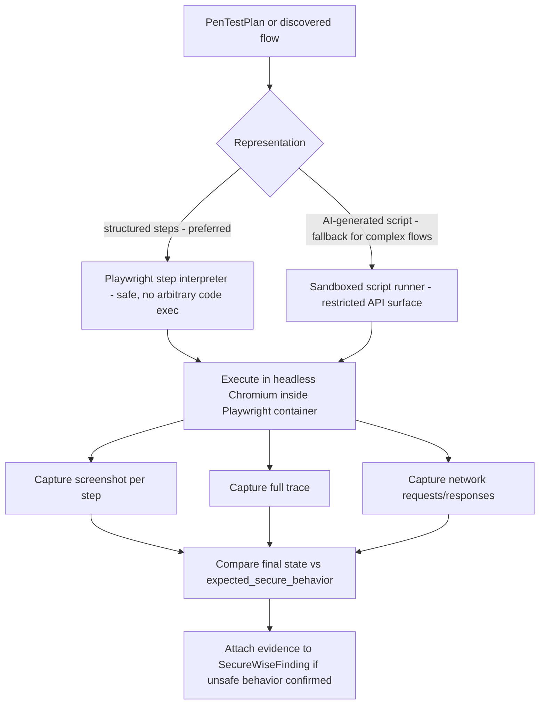

# Playwright Automation Engine — Design

## Purpose

Provide authenticated, real-browser test execution against the sandboxed target application, driven either
by AI-generated scenarios (from `AI_PENTEST_PLANNER.md`) or by discovered business flows
(`CodeUnderstandingEngine` route/form discovery). This is the component that makes "safe pen-testing" and
"authenticated crawling" possible, since most interesting security issues (IDOR, role bypass, business logic
abuse) require an authenticated session, not just anonymous HTTP requests.

New module: `apps/securewise/services/playwright_engine.py`, running Playwright inside its own
resource-limited container on the same per-scan Docker network as the target app
(`RUNTIME_TEST_ENVIRONMENT.md`), never on the host directly.

## Use cases

1. **Login flow testing** — verify the discovered auth flow works, capture the authenticated session/cookie
   for reuse by subsequent scenarios (avoids re-logging-in per test).
2. **Authenticated crawling** — traverse discovered routes while logged in, to find pages/endpoints an
   anonymous crawl (ZAP spider) would never reach.
3. **Business journey testing** — execute a short multi-step flow (e.g., "create item → view item → attempt
   to view another user's item by ID" for IDOR testing) as directed by a `PenTestPlan`.
4. **Evidence capture** — screenshots at each step, full Playwright trace (`.zip`) for later inspection,
   optional video recording for critical findings.
5. **Form discovery** — enumerate forms/inputs the static analysis might miss (client-side rendered forms),
   feeding back into API/DAST target lists.
6. **AI-generated tests from code understanding** — LLM reads route + frontend API client code and produces
   a Playwright test script (JS/TS) or a structured step list (safer, more parseable) that this engine
   executes.
7. **Regression testing after fix** — once a finding is marked "fixed" (`retest_status`, see
   `UNIFIED_FINDING_MODEL.md`), the same Playwright scenario can be re-run to confirm the fix holds.

## Execution model



**Preferred representation is structured steps, not arbitrary AI-generated code**, for safety: a small,
whitelisted step vocabulary (`goto`, `fill`, `click`, `expect_status`, `expect_text`, `expect_url`,
`extract_cookie`, `assert_response_contains`) that the interpreter executes, rather than `eval`-ing
LLM-authored JavaScript. AI-generated full scripts are a fallback only for complex flows explicitly flagged
low-risk, run inside a further-sandboxed subprocess with no filesystem/network access beyond the target app.

## Safety controls specific to Playwright

- Browser context uses a dedicated test account (see `AI_PENTEST_PLANNER.md` — no real user credentials,
  ever).
- Navigation is restricted to the sandboxed `base_url` origin only (Playwright's `route()` interception used
  to hard-block any request leaving that origin — defense in depth beyond the network isolation already
  provided by `RuntimeEnvironmentManager`).
- Max step count and max wall-clock time per scenario (e.g., 20 steps / 60 seconds) to prevent runaway
  scripts.
- No file-system download/upload actions beyond what a `PenTestPlan` scenario explicitly declares (e.g., a
  file-upload-validation test uses a small, safe, non-malicious test fixture file — never a real exploit
  payload like an actual webshell).

## Data model

```python
class SecureWisePlaywrightRun(models.Model):
    scan = models.ForeignKey(SecureWiseScan, on_delete=models.CASCADE, related_name="playwright_runs")
    pentest_plan = models.ForeignKey(SecureWisePenTestPlan, null=True, blank=True, on_delete=models.SET_NULL)
    scenario_title = models.CharField(max_length=255)
    status = models.CharField(max_length=20, choices=[("passed", "passed"), ("failed_secure", "failed_secure"), ("finding", "finding"), ("error", "error")])
    steps_executed = models.JSONField(default=list)
    screenshots = models.JSONField(default=list)   # storage URLs (Cloudinary or local media, mirrors existing avatar upload pattern)
    trace_url = models.CharField(max_length=1000, blank=True)
    network_log = models.JSONField(default=list)
    duration_ms = models.IntegerField(default=0)
    created_at = models.DateTimeField(auto_now_add=True)
```

`status="finding"` means the scenario proved `unsafe_behavior` occurred → a `SecureWiseFinding` is created,
referencing this run's screenshots/trace as `evidence`.

## AI test generation prompt inputs

Reuses the same code-understanding artifacts as the pen-test planner (routes, forms, frontend API client
calls). Output is either:
- a structured step list (see vocabulary above) — always preferred, and
- optionally a human-readable Playwright `.spec.ts` file **for developer reference only** (attached to the
  scan as a downloadable artifact so developers can add it to their own regression suite) — this generated
  file is never itself executed by SecureWise; only the structured interpreter path is executed.

## Storage & evidence

Screenshots/traces are uploaded via the **existing shared Cloudinary core**
(`apps/common/cloudinary_service.py`, already used by `speaking_buddy` and `marketplace`) — no new upload
plumbing needed, just a new domain wrapper `apps/securewise/services/evidence_storage.py` analogous to
`apps/speaking_buddy/services/cloudinary_service.py`.

## Dependencies

- `playwright` Python package + browser binaries — must be added to `requirements.txt` and the scanner
  runner Docker image (not the target-app image); browsers should be installed at image-build time
  (`playwright install --with-deps chromium`) to avoid slow first-run downloads during a scan.
