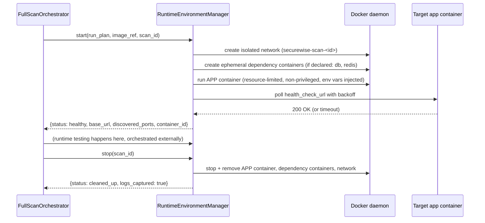

# RuntimeEnvironmentManager — Design

## Purpose

Own the full lifecycle of "start the target application safely, make it reachable to dynamic scanners, then
tear everything down" — the missing piece that makes DAST/API/Playwright/pen-test scenarios possible at all
today. New module: `apps/securewise/services/runtime_environment.py`.

## Responsibilities (lifecycle)



## Workspace isolation

- Each scan gets a dedicated ephemeral directory: `/tmp/securewise-scans/<scan_id>/` — this is the **only**
  filesystem path the process reads/writes for that scan (repo clone, generated Dockerfile, logs, evidence
  captures). Deleted unconditionally at teardown.
- No bind-mount of any host path into the target container beyond that scan-specific tempdir subtree (and
  only if the build strategy needs it — most runs should COPY into the image at build time instead of
  bind-mounting, reducing live host filesystem exposure).

## Network isolation

- A new Docker network is created per scan: `securewise-scan-<scan_id>` (bridge driver, `internal: true`
  where possible so containers cannot reach the public internet, with a narrow allow-list punched through
  only for package registries needed at *build* time, not at *runtime*).
- Runtime containers (the target app + any dependency containers) are attached **only** to this network —
  never to the host network, never to the network any other tenant's scan uses.
- Scanner containers (ZAP, Playwright, AI pentest runner) join the *same* per-scan network so they can reach
  the target app by its container DNS name, but nothing outside that network can reach it — SecureWise's own
  API/DB stays on a separate network entirely.

## Resource limits (enforced per container)

| Limit | Default |
|---|---|
| CPU | `--cpus=1.0` per container |
| Memory | `--memory=1g` app container, `512m` dependency containers |
| PIDs | `--pids-limit=256` |
| Wall-clock timeout | 10 minutes max app lifetime per scan (configurable via `SecureWiseScanPolicy`) |
| Disk | Ephemeral workspace capped (e.g., 2GB quota via tmpfs/overlay size limit) |
| Privileges | Always `--security-opt=no-new-privileges`, never `--privileged`, never `--cap-add` beyond defaults |

## Health check & endpoint discovery

- Poll `ApplicationRunPlan.health_check_url` (default `/` if none detected) with exponential backoff, max
  ~60s total before declaring the app failed to start (this failure is itself a **finding**: "Application did
  not become healthy within timeout" — useful signal, not silently swallowed).
- Once healthy, optionally perform a lightweight discovery crawl (reuse ZAP spider from
  `ZAP_DAST_ENGINE.md`, or a simple internal route-list from `CodeUnderstandingEngine`'s route detection) to
  build the initial target list for DAST/API/Playwright, rather than re-inventing discovery logic here.

## Log capture

- `docker logs <container>` captured continuously to a bounded ring buffer (e.g., last 2000 lines), persisted
  as `SecureWiseScanEngineResult.raw_summary` (existing field) under a new `scanner_type="runtime_start"`
  entry, and surfaced in the scan detail UI as "Application Logs" so failures are debuggable without SSH
  access to the sandbox host.

## Safety guarantees (restated, enforced at the manager level, not just policy)

- No host filesystem access outside the per-scan tempdir.
- No privileged containers, ever — the manager refuses to start a container requesting `privileged: true`
  even if it came from an existing `docker-compose.yml` (compose validation step in `DockerizationEngine`
  strips/rejects this).
- No real production secrets are ever injected — required env vars detected by `CodeUnderstandingEngine` are
  filled with **generated dummy values** (random strings/test API keys) unless the user explicitly supplies
  scan-specific safe test credentials via the scan-creation form (opt-in, stored encrypted like
  `SecureWiseGitIntegration._encrypted_access_token` already is).
- Teardown is guaranteed via a `try/finally` in the orchestrator **and** a separate periodic reaper
  (management command, e.g. `cleanup_stale_scan_environments`) that removes any container/network/tempdir
  older than its scan's max lifetime, in case the process crashes mid-scan — mirrors the existing pattern of
  `ScannerRunner` already using `tempfile` + explicit `shutil.rmtree` cleanup (`services/scanner.py:61-76`),
  extended to containers/networks.

## Data model addition

```python
class SecureWiseRuntimeEnvironment(models.Model):
    scan = models.OneToOneField(SecureWiseScan, on_delete=models.CASCADE, related_name="runtime_environment")
    container_id = models.CharField(max_length=128, blank=True)
    network_name = models.CharField(max_length=128, blank=True)
    base_url = models.CharField(max_length=500, blank=True)
    status = models.CharField(
        max_length=20,
        choices=[("starting", "starting"), ("healthy", "healthy"), ("failed", "failed"), ("stopped", "stopped")],
        default="starting",
    )
    started_at = models.DateTimeField(null=True, blank=True)
    stopped_at = models.DateTimeField(null=True, blank=True)
    logs_excerpt = models.TextField(blank=True)
    failure_reason = models.TextField(blank=True)
```
