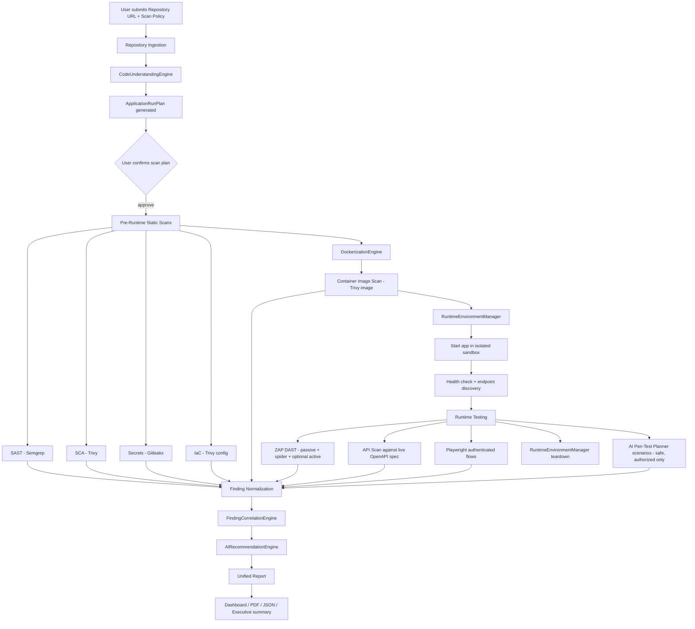
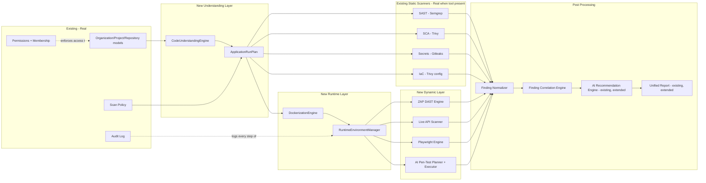
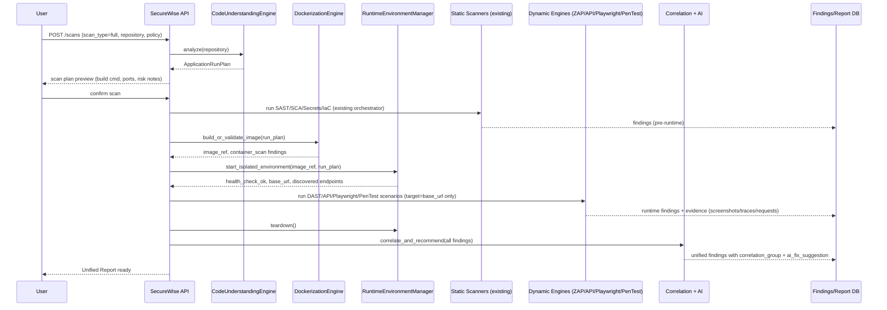
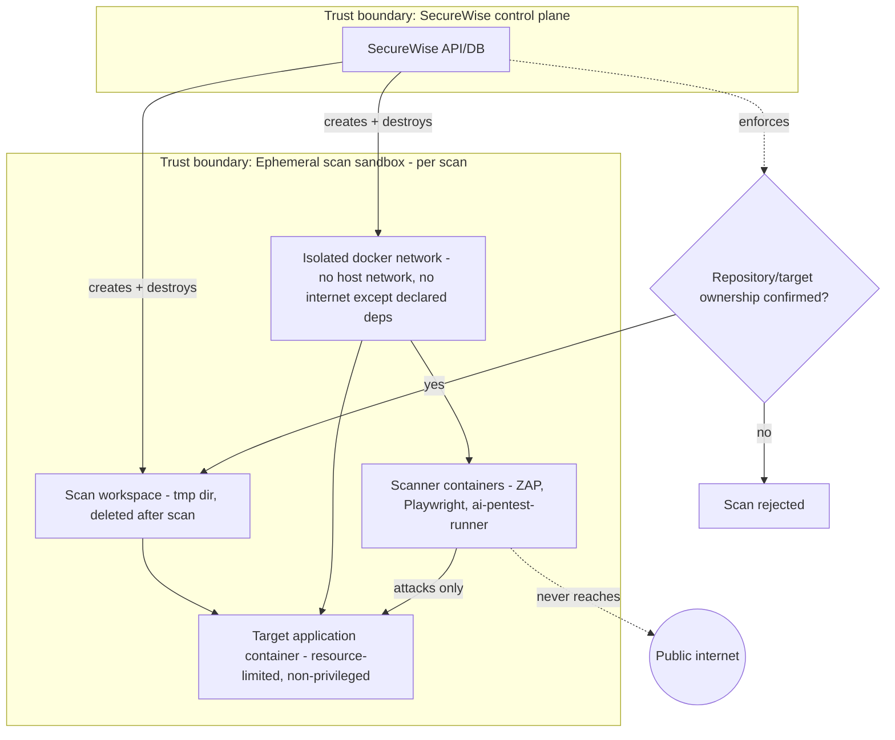

# SecureWise — Target Architecture

This document describes the target end-to-end architecture for SecureWise's evolution from a static-analysis
SaaS into a full "repo-to-report" application security testing platform, per the product vision. It builds on
top of the existing real components (data model, RBAC, audit log, report pipeline) documented in
`CURRENT_SECUREWISE_REVIEW.md` and adds the missing runtime/dynamic-testing layer.

---

## 1. High-level pipeline

---

## 2. Component responsibilities

---

## 3. Sequencing within a "Full Scan"

---

## 4. Isolation & authorization boundaries (non-negotiable)

Key rules encoded in this boundary (carried through every subsequent design doc):

1. Dynamic/pentest testing **only** ever targets the ephemeral container SecureWise itself started, or a URL
   the user has explicitly attested ownership/authorization for (tracked via a new
   `target_authorization_confirmed` + `target_authorization_note` field on `SecureWiseScan`).
2. No scan sandbox has outbound internet access except to resolve declared package/dependency registries
   needed to build the app (allow-listed).
3. Containers run non-privileged, with CPU/memory/pids/time limits, and are destroyed unconditionally at the
   end of the scan (including on error/timeout paths).
4. No destructive test payloads (data deletion, real credential brute force, DoS) run in MVP — this is
   enforced at the `PenTestPlan.destructive` flag level (see `AI_PENTEST_PLANNER.md`) and rejected by the
   executor if `destructive=true`.

---

## 5. Where this plugs into the existing (real) codebase

- `SecureWiseScan.scan_type` already has a `full` option (`models.py`) — the new orchestrator becomes the
  handler for `full`, extending (not replacing) the existing `services/scanner.py::ScannerRunner`.
- `SecureWiseScanEngineResult` already models per-engine results generically enough to add new engine types
  (`dockerize`, `runtime_start`, `zap_dast`, `playwright`, `ai_pentest`) without a schema change beyond
  extending the `scanner_type` choices.
- `SecureWiseFinding` needs the additive fields described in `UNIFIED_FINDING_MODEL.md`
  (`exploitability`, `cvss`, `correlation_group`, `retest_status`) — additive migration, no breaking change.
- The existing `AuditLog` + `_audit()` helper (`views.py:74-87`) should be used for every new lifecycle event
  (`runtime.start`, `runtime.stop`, `dockerize.build`, `pentest.scenario_run`) — no new logging mechanism
  needed.
- Async execution: this is the point at which the current thread-based MVP execution model becomes
  insufficient (see Phase 1 in `IMPLEMENTATION_ROADMAP.md`) — a real queue (Celery + Redis, or RQ) is a
  prerequisite for safely running multi-minute build+runtime+dynamic-scan jobs concurrently across tenants.
