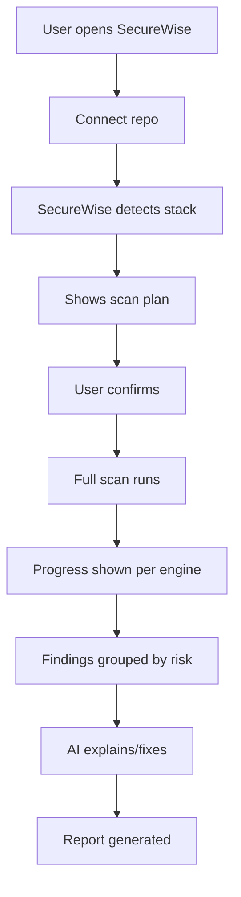

# UX Gap Analysis — SecureWise Frontend

Reviewed repo: `securewise-frontend` (React 19 + TypeScript + Vite, separate from the main `gw-frontend`
static site). Stack confirmed via `package.json:18-44`, `src/App.tsx:1-44`.

## Target user flow (per vision) vs current reality

| Step | Target | Current reality | Gap |
|---|---|---|---|
| Open SecureWise | Single clear entry point | Dashboard + separate Organizations/Projects/Repositories/Scan-Policies/Scans/Findings/Reports/Integrations/Settings pages (`App.tsx:23-39`) | No unified "get started" wizard; a new user must understand org→project→repo→policy→scan as separate CRUD steps before their first scan. Real but not streamlined. |
| Connect repo | One clear "connect repo" step | Split across **Integrations** (git provider token) and **Repositories** (add repo URL, validate, pick integration) pages (`RepositoriesPage.tsx:383-452`) | Functionally real (validates repo URL via `/repositories/validate/`), but UX requires knowing to visit two different pages first. **Gap: no single "Add repository" flow that chains integration setup + repo add + validate in one guided sequence.** |
| Detect stack | Shown automatically before scanning | **Does not exist.** No `CodeUnderstandingEngine` on the backend yet (per `CURRENT_SECUREWISE_REVIEW.md`), so there is nothing for the frontend to display. | **Full gap** — frontend has no concept of a "detected stack" card at all today. |
| Show scan plan / confirm | User previews build/run plan before committing | `ScansPage.tsx:693-704` shows only inline static hint text like "Full Scan will run…", not a real generated plan | **Full gap** — no actual plan preview exists because there is no backend `ApplicationRunPlan` yet. This is the most important missing UI surface once `CODE_UNDERSTANDING_ENGINE.md` is implemented. |
| Full scan runs | One "Full Scan" button that triggers everything | Scan creation form already supports `scan_type=full` plus org/project/repo/policy selection (`ScansPage.tsx:576-760`) | Real and functional today for whatever "full" currently means (static scanners only, per backend audit) — will need no structural UI change once the orchestrator does more, since engine rows are already generic. |
| Progress per engine | Real-time, per-engine status | **Already real** — polls `/scans/{id}/progress/` every 3s, renders per-engine rows with status/duration/skip-reason (`ScanDetailPage.tsx:77-118, 277-330`) | **No gap** — this is one of the most production-ready parts of the frontend. New engines (dockerize, runtime_start, zap_dast, playwright, ai_pentest) will render using this same existing mechanism with zero/minimal frontend changes, since it already handles arbitrary named engine rows. |
| Findings grouped by risk | Grouped/correlated, not a flat noisy list | Flat findings table with severity/title/scanner/CWE/OWASP/file/status columns (`FindingsPage.tsx:247-306`); no grouping/correlation UI | **Gap** — needs a "correlated incident" card view once `FindingCorrelationEngine` (backend) exists; today each finding is an independent row. |
| AI explains/fixes | Rich AI remediation shown inline | **Already real and good** — dedicated AI remediation panel with confidence badge, explanation, fixed code, framework guidance, regenerate action, and an honest "not configured" fallback (`FindingDetailPage.tsx:520-685`) | **No gap** for what exists; will need extension once `AI_RECOMMENDATION_ENGINE.md`'s richer structured response (exploit scenario, verification tests, suggested PR patch) ships — the panel's layout can accommodate additional sections without a redesign. |
| Report generated | Downloadable, multiple formats/audiences | **Already real** — Reports page supports security_summary/executive_summary/developer_remediation/owasp_top10/cwe_top25/quality_gate types, HTML view + PDF download (`ReportsPage.tsx:220-370`, `66-96`) | **No gap** for current scope; will need a "runtime evidence" section (screenshots/traces from Playwright/ZAP) once those engines exist. |

## Additional UX gaps found (not directly from the target flow diagram, but material)

1. **No RBAC-aware UI.** Backend correctly enforces org-scoped roles (`owner/admin/security_engineer/
   developer/auditor`), but the frontend shows the same navigation/actions to every authenticated user
   regardless of role (`Sidebar.tsx:4-33`) — a `developer`-role user sees write-action buttons the backend
   will then reject, which is confusing rather than insecure. **Recommendation:** gate destructive/write
   actions (start scan, create policy, invite member) behind a role check sourced from the existing
   `/memberships/` data already available to the frontend via `AuthContext`.
2. **No i18n.** Zero internationalization framework found (no `i18n`/`locale`/`t(` usage anywhere in `src/`)
   — English-only, unlike the rest of GuideWisey's product suite which supports NL/EN. Out of scope for the
   security-engine work but worth flagging for product consistency.
3. **Limited mobile design.** Some responsive handling exists (`Layout.tsx:47-61`, media queries in
   `index.css`), but tables/detail pages (Findings, Scan Detail) are desktop-oriented and likely to be
   cramped on small screens — lower priority than the functional gaps above given SecureWise's primary users
   are almost certainly desktop-based security/dev practitioners.
4. **"Coming soon" / cosmetic honesty issues** — Microsoft Entra ID SSO is marked "coming soon" in Settings
   (`SettingsPage.tsx:109-112`); this is honestly labeled already, not a fake feature, but worth confirming
   it stays labeled as such and isn't accidentally presented as available.
5. **No authorization-confirmation UI** for dynamic/runtime scanning — once `TARGET_ARCHITECTURE.md`'s
   authorization gate (`target_authorization_confirmed`) exists on the backend, the scan-creation form
   (`ScansPage.tsx:576-760`) needs a new required checkbox + text field before a `full` scan (or standalone
   `dast`) can be submitted, analogous to how `consent_confirmed` is already handled elsewhere in GuideWisey
   (e.g., `speaking_buddy`'s avatar photo upload consent checkbox) — same UX pattern, new context.

## What does NOT need to change

The scan progress polling UI, findings detail view, AI remediation panel, and report generation/export flows
are already well-built, functionally real, and extensible enough to absorb the new engines/data without a
redesign — this is a genuinely positive finding from the audit and should inform sequencing: **prioritize
backend capability (Phases 2-6 in `IMPLEMENTATION_ROADMAP.md`) over frontend rework**, since the frontend
shell that will display the new data mostly already exists.
