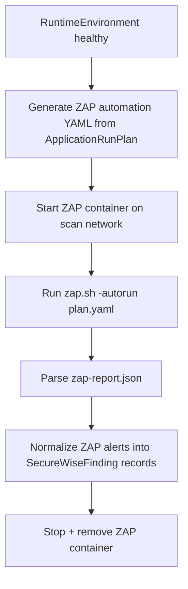

# ZAP DAST Engine — Design

## Purpose

Replace the current passive-only "DAST" (`scanners/dast.py:30-78` — literally just `requests.get()` and
header/cookie inspection) with a real OWASP ZAP integration. This is the single highest-priority gap called
out in `CURRENT_SECUREWISE_REVIEW.md` (§3, §6) — SecureWise cannot honestly claim "DAST" without this.

New module: `apps/securewise/scanners/zap_dast.py`, replacing the body of the current `dast.py` scanner
(the existing scanner's interface/registration in the orchestrator stays the same — only the
implementation changes; this keeps the change additive/backward compatible for anything relying on
`scanner_type="dast"`).

## Why ZAP, and how it runs

- ZAP is run **headless in its own Docker container** (`ghcr.io/zaproxy/zaproxy:stable` or similar), attached
  to the same per-scan isolated network as the target app (`RUNTIME_TEST_ENVIRONMENT.md`) — never installed
  directly on the SecureWise host/worker.
- Target is **always** `RuntimeEnvironment.base_url` for a `full` scan (the app SecureWise itself started),
  or an explicitly authorized external URL if the user is running a standalone `dast` scan against their own
  already-running instance (`SecureWiseScan.target_authorization_confirmed` required either way).

## ZAP Automation Framework YAML (generated per scan, not hand-maintained)

SecureWise generates a ZAP Automation Framework plan dynamically rather than shelling out ad-hoc CLI flags,
so behavior is versioned/reviewable and matches ZAP's recommended modern usage:

```yaml
env:
  contexts:
    - name: "securewise-scan"
      urls: ["{{ base_url }}"]
      authentication:
        method: "{{ auth_method }}"   # "form" | "script" | "none" - derived from ApplicationRunPlan.auth_flows
  parameters:
    failOnError: false
    progressToStdout: true
jobs:
  - type: spider
    parameters:
      context: "securewise-scan"
      maxDuration: 3
  - type: passiveScan-wait
    parameters:
      maxDuration: 2
  - type: spiderAjax
    parameters:
      context: "securewise-scan"
      maxDuration: 3
    # only included if ApplicationRunPlan detects a JS-heavy frontend framework
  - type: activeScan
    parameters:
      context: "securewise-scan"
      policy: "securewise-safe-active-policy"
    # ONLY included if SecureWiseScan.allow_active_scan == True (explicit opt-in, off by default)
  - type: report
    parameters:
      template: "traditional-json"
      reportDir: "/zap/wrk/"
      reportFile: "zap-report.json"
```

Key points:
- **Passive scan + spider run by default** — safe, non-intrusive, always allowed once authorization is
  confirmed.
- **AJAX spider** included automatically only for JS-heavy frontends (detected by `CodeUnderstandingEngine`)
  since it's needed to crawl SPA routes.
- **Active scan is opt-in** (`SecureWiseScan.allow_active_scan`, default `False`) — this is the closest thing
  to "real" exploitation attempts (e.g., actual SQLi/XSS payload injection) and must be a conscious user
  choice, not a default, per the MVP "no destructive payloads" rule. When enabled, it uses a **custom safe
  policy** (`securewise-safe-active-policy`) that disables ZAP's inherently destructive scan rules (e.g.,
  rules that attempt OS command injection with real destructive payloads, or DoS-style rules) — this policy
  file is maintained in-repo (`apps/securewise/scanners/zap_policies/securewise-safe-active-policy.policy`)
  and reviewed whenever ZAP is upgraded.
- Auth: if `ApplicationRunPlan.auth_flows.type == "session"` with a known login endpoint, ZAP is configured
  with form-based auth using the same throwaway test account `RuntimeEnvironmentManager` provisions for
  Playwright scenarios (single shared test identity, reused rather than SecureWise inventing separate
  credentials per engine).

## Execution flow



## Normalizing ZAP output (never attach the raw HTML report as "the" report)

ZAP's JSON report alerts are mapped field-by-field into `SecureWiseFinding`:

| ZAP alert field | SecureWiseFinding field |
|---|---|
| `alert` / `name` | `title` |
| `desc` | `description` |
| `riskdesc` (High/Medium/Low/Informational) | `severity` (mapped to SecureWise's severity enum) |
| `confidence` | `confidence` |
| `cweid` | `cwe_id` |
| `wascid` / alert category | `owasp_category` (via lookup table, extending `scanners/cwe_mapping.py`) |
| `instances[].uri` | `endpoint` |
| `instances[].method` | stored in `evidence` |
| `instances[].evidence` | `evidence` JSON (raw matched string) |
| `solution` | seeds `recommendation` (further enriched by `AIRecommendationEngine`) |
| `reference` | `references` |
| computed: `scanner_type="dast"`, `scanner_source="zap"` | new/existing fields on `SecureWiseFinding` |

This directly satisfies the requirement: **"Do not simply attach ZAP HTML report. Normalize all ZAP alerts
into SecureWise findings."**

## Safety & resource limits

- ZAP container: same resource caps as other scan containers (`RUNTIME_TEST_ENVIRONMENT.md` defaults),
  `maxDuration` fields in the automation YAML additionally cap spider/scan wall-clock time independent of the
  container-level timeout (defense in depth).
- Active scan (when opted in) always uses the safe policy — never ZAP's full "Default Policy," which
  includes intrusive/destructive rules.
- ZAP is torn down with the rest of the per-scan environment — no lingering ZAP session data persists beyond
  the scan record itself.

## Dependencies

- ZAP Docker image pulled at deploy/build time (or on first use, cached thereafter) — no changes needed to
  the main SecureWise application image; ZAP runs as a sibling container, not a Python dependency.
- `python-owasp-zap-v2.4` client library is a **nice-to-have** for programmatic control, but the Automation
  Framework YAML approach above avoids requiring it — reduces coupling and version-fragility.
